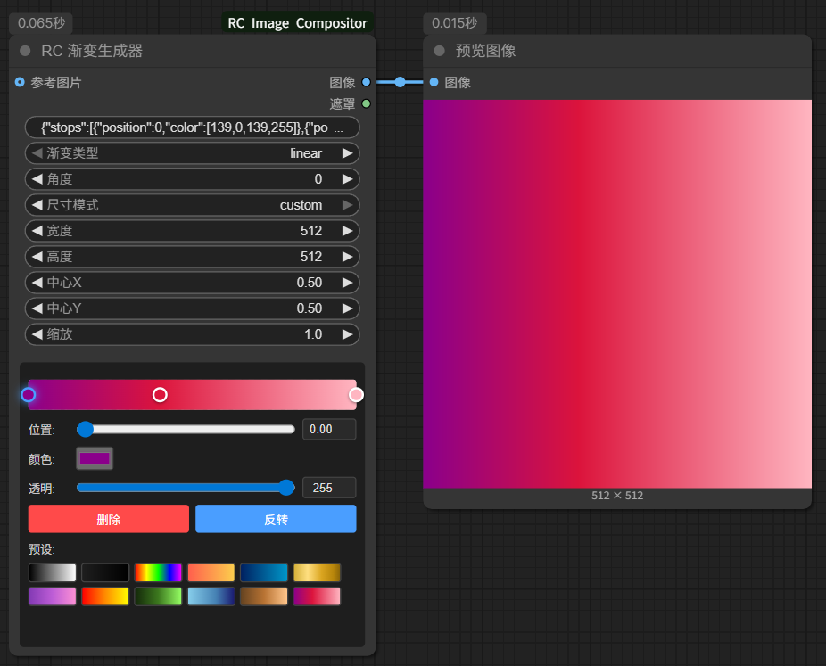
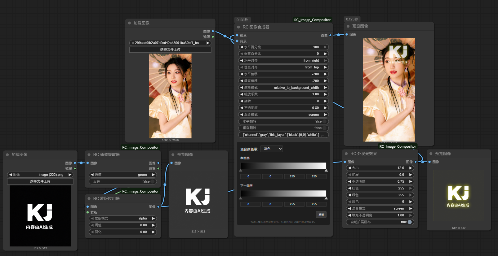

# RC Image Compositor 🎨

A comprehensive ComfyUI plugin suite that brings **professional Photoshop-style layer effects** and **advanced compositing capabilities** to your workflows. Recent updates add a clearer Blend-If interface, high-precision curves display under ComfyUI zoom, and draggable gradient stops for faster toning workflows.

[中文版 README](README_zh.md)

---

## 🖼️ Feature Showcase

### Professional Layer Blending

*RC Image Compositor supports all 24 professional Photoshop-style blend modes including HSL modes for precise compositing control.*

### Advanced Curves Adjustment

*Interactive curves editor with natural cubic spline interpolation, supporting RGB and individual channel adjustments for professional color grading.*

### Professional Gradient Mapping

*Transform your images with gradient mapping - perfect for color grading, tone mapping, and creative color effects with 16 blend modes.*

### Intelligent Gradient Generator

*Create custom gradients with multiple color stops, transparency support, and various gradient types (linear, radial, angular, reflected).*

### Auto Color Correction

*Photoshop-style automatic color correction with 4 intelligent algorithms for instant image enhancement.*

### Professional Color Balance

*Fine-tune color balance with CMY controls and tonal range selection for precise color correction.*

### High/Low Frequency Skin Smoothing

*Professional frequency separation technique with automatic skin tone detection and edge protection for natural portrait retouching.*

### Complete Layer Effects Workflow

*Comprehensive workflow showcasing outer glow effects, layer blending, and watermark creation - all with automatic canvas expansion.*

---

## ✨ Key Features

### 🎭 **Professional Layer Styles**
- **Drop Shadow** - Photoshop-compatible drop shadow effect with blur, offset, and color control
- **Stroke** - Inner/outer/center stroke positioning with custom color and auto-canvas expansion
- **Outer Glow** - Soft outer glow effect with spread, color options, and auto-canvas expansion

### 🎨 **Complete Blend Mode Suite**
- **24 Professional Blend Modes** Including all HSL modes (Hue, Saturation, Color, Luminosity)
- **Blend Color Band** - Photoshop-style Blend If functionality with channel-based masking for advanced compositing control
- **Enhanced Positioning System** - Achieve precise positioning control with alignment options
- **Detailed Tooltips** - Every blend mode comes with visual descriptions
- **Optional Background Support** - Automatically creates transparent canvas when no background is specified

### 🔧 **Professional Filters & Adjustments**
- **Gaussian Blur** - Professional-grade blur effect with PIL/OpenCV algorithm selection
- **Unsharp Mask Sharpening** - Multiple sharpening algorithms
- **High/Low Frequency Skin Smoothing** - Photoshop-style frequency separation technique with automatic skin tone detection and edge protection
- **Hue/Saturation Adjustment** - Photoshop-like targeted color editing with **intelligent presets** (Cyanotype, Sepia, Vibrance, etc.)
- **Opacity Control** - Precise transparency adjustment with alpha channel support
- **Levels Adjustment** - Input/output levels with gamma correction and **quick-access presets** (Increase Contrast, Lighten, Darken, High Contrast)
- **Curves Adjustment** - Photoshop-style multi-channel curves with interactive editor, natural cubic spline interpolation, RGB/individual channel support, and preset library
- **Brightness/Contrast** - Professional brightness and contrast control
- **Color Balance** - CMY color balance with tonal range selection
- **Channel Mixer** - Advanced RGB channel mixing with **B&W filter presets** (Red, Orange, Yellow, Green, Blue, Infrared filters)
- **Auto Color Correction** - Photoshop-style automatic color correction with 4 algorithms (Enhance Monochromatic, Per-Channel, Dark/Light Colors, Brightness/Contrast)
- **Gradient Map** - Professional gradient mapping for color grading, tone mapping, and creative color effects with 16 blend modes and luminosity preservation
- **Threshold** - High-contrast black and white conversion with multiple calculation methods and inversion support
- **Vibrance** - Smart saturation enhancement with adjustable skin tone protection and advanced HSV processing
- **Add Noise** - Customizable noise effects with 5 types (Gaussian, Gaussian Blur, Uniform, Salt & Pepper, Speckle) for texture and artistic effects

### 🛠️ **Utility Tools**
- **Canvas Padding** - Multiple padding modes (solid color, edge, mirror, transparent)
- **Image Scale** - 6 scaling methods with high-quality resampling
- **Image Crop** - Flexible cropping with manual, center, and aspect ratio modes
- **Canvas Resize** - 9 anchor positions with background color control

### 🎞️ **Channel Operations**
- **Channel Extractor** - Extract RGB channels or luminance as grayscale or mask, commonly used for matting workflows
- **Mask Apply** - Use mask to control image transparency, achieving matting effects with smooth feathering

### 🌈 **Gradient Generation & Mapping**
- **Gradient Generator** - Create gradient images with transparency support and multiple color stops, computed with high-efficiency lookup tables
- **Gradient Map** - Professional gradient mapping for color grading, tone mapping, and creative color effects with 16 blend modes and luminosity preservation
- **Enhanced Presets** - Professional gradient presets including Sepia, Cool Blue, Fire Heat, Thermal, Film Noir, and more for quick creative workflows

---

## 🎯 Perfect For

- **UI Design Workflows** - Logo placement, watermarks, interface elements
- **Text Effects** - Professional typography with shadows, strokes, and glows
- **Multi-Image Compositing** - Complex layer compositions with precise control
- **Photo Enhancement** - Color correction, sharpening, and artistic effects
- **Professional Design** - Complete Photoshop-style layer workflows

---

## 📦 Node Categories

### **RC/Image** - Core Compositing
- `RC Image Compositor (Complete)` - Complete compositor with 24 blend modes and enhanced positioning (supports optional background)
- `RC Load Image (Alpha)` - RGBA image loading with full alpha channel preservation

### **RC/Layer Effects** - Photoshop Layer Styles
- `RC Drop Shadow` - Professional drop shadow effect with auto-canvas expansion
- `RC Stroke` - Inner/outer/center stroke with auto-canvas expansion
- `RC Outer Glow` - Soft outer glow effect with auto-canvas expansion

### **RC/Filters** - Image Processing
- `RC Gaussian Blur` - Professional-grade blur with algorithm selection
- `RC Sharpen` - Multiple sharpening methods including unsharp mask
- `RC High/Low Frequency Skin Smoothing` - Photoshop-style frequency separation skin smoothing with skin tone detection

### **RC/Adjustments** - Color & Tone
- `RC Hue/Saturation` - Targeted color adjustment with tint mode
- `RC Opacity Adjust` - Precise transparency control with alpha channel support
- `RC Levels` - Professional levels adjustment with gamma correction
- `RC Curves` - Multi-channel curves adjustment with interactive editor, natural cubic spline interpolation, RGB/individual channel support, and preset library
- `RC Brightness/Contrast` - Dual-algorithm brightness and contrast control
- `RC Color Balance` - CMY color balance with tonal range positioning
- `RC Channel Mixer` - Advanced RGB channel mixing with monochrome mode

### **RC/Utilities** - Canvas & Transform
- `RC Canvas Padding` - Canvas expansion with multiple padding modes
- `RC Image Scale` - Professional scaling with 6 different methods
- `RC Image Crop` - Flexible cropping with manual, center, and ratio modes
- `RC Canvas Resize` - Canvas resizing with 9 anchor positions

### **RC/Channel** - Channel & Mask Operations
- `RC Channel Extractor` - Extract RGB channels or luminance as grayscale or mask, commonly used for matting workflows
- `RC Mask Apply` - Use mask to control image transparency, with efficient feathering for smooth edges

### **RC/Generate** - Generate Operations
- `RC Gradient Generator` - Create gradient images with transparency support and multiple color stops via lookup-table acceleration

---

## 🚀 Installation

### Method 1: ComfyUI Manager (Recommended)
1. Open **ComfyUI Manager**
2. Go to **Install Custom Nodes**
3. Search for **"RC Image Compositor"**
4. Click **Install**

### Method 2: Manual Install
```bash
cd ComfyUI/custom_nodes
git clone https://github.com/kj863257/ComfyUI_RC_Image_Compositor
cd ComfyUI_RC_Image_Compositor
pip install -r requirements.txt
```
Then restart ComfyUI

---

## 🎨 Precise Positioning System

### **Edge Alignment**
- **Right edge, tight fit**: `x_percent=100`, `x_align=from_right`, `x_offset=0`
- **Left edge, tight fit**: `x_percent=0`, `x_align=from_left`, `x_offset=0`
- **Bottom edge, tight fit**: `y_percent=100`, `y_align=from_bottom`, `y_offset=0`

### **Usage Examples**
1. **Right-top corner with 10px margin**:
   - `x_percent=100`, `x_align=from_right`, `x_offset=10`
   - `y_percent=0`, `y_align=from_top`, `y_offset=10`

2. **Left-bottom corner with 20px margin**:
   - `x_percent=0`, `x_align=from_left`, `x_offset=20`
   - `y_percent=100`, `y_align=from_bottom`, `y_offset=20`

---

## 🔧 Advanced Features

### **Complete Blend Mode Compatibility**
All 24 blend modes are mathematically identical to Photoshop's implementation with detailed tooltips:

**🌟 Basic Modes:**
- Normal - Direct overlay

**🌑 Darken Modes:**
- Darken, Multiply, Color Burn, Linear Burn

**🌕 Lighten Modes:**
- Lighten, Screen, Color Dodge, Linear Dodge

**⚡ Contrast Modes:**
- Overlay, Soft Light, Hard Light, Vivid Light, Linear Light, Pin Light, Hard Mix

**🔄 Comparative Modes:**
- Difference, Exclusion, Subtract, Divide

**🎨 HSL Modes:**
- Hue, Saturation, Color, Luminosity

### **Auto-Canvas Expansion**
Layer effects automatically expand the canvas when effects exceed original boundaries:
- Drop Shadow: Expands canvas for shadow distance and blur
- Stroke: Expands canvas for external and center strokes
- Outer Glow: Expands canvas for glow size and spread

### **Professional Color Editing**
- Targeted color range adjustments (red, blue, etc.) in hue/saturation
- Luminance preservation in color balance adjustments
- Channel-specific level adjustments (RGB, red, green, blue)
- Monochrome conversion with custom channel mixing
- **Advanced Curves Adjustment** - Photoshop-style multi-channel curves with interactive editor, natural cubic spline interpolation, and preset support

### **Advanced Masking & Channel Operations**
- **Channel Extraction** - Extract specific channels (red, green, blue, alpha, or luminance) from images for matting
- **Mask Application** - Use masks to control image transparency, achieving precise matting effects
- **Transparent Background Support** - Automatically creates transparent canvas when no background is provided, facilitating foreground-only element processing

---

## 🌟 Why Choose RC Image Compositor?

- **🎯 Photoshop Accuracy**: Mathematically identical blend modes and effects
- **🚫 No Negative Offset Issues**: Enhanced positioning system solves alignment problems
- **🌐 Bilingual Support**: Complete Chinese/English interface and documentation
- **🔧 Professional Grade**: Built for production workflows with auto-canvas expansion
- **📱 User Friendly**: Detailed tooltips explain every parameter and blend mode
- **🚀 High Performance**: Vectorized algorithms (NumPy/OpenCV/PIL) keep large images responsive
- **🛠️ Extensible**: Clean modular architecture for easy customization

---

## 📄 License

This project is licensed under the MIT License.

---

*Crafted with ❤️ for the ComfyUI community*

> **"Complete Photoshop power in ComfyUI - Professional nodes with 24 blend modes, zero negative offset headaches."**
