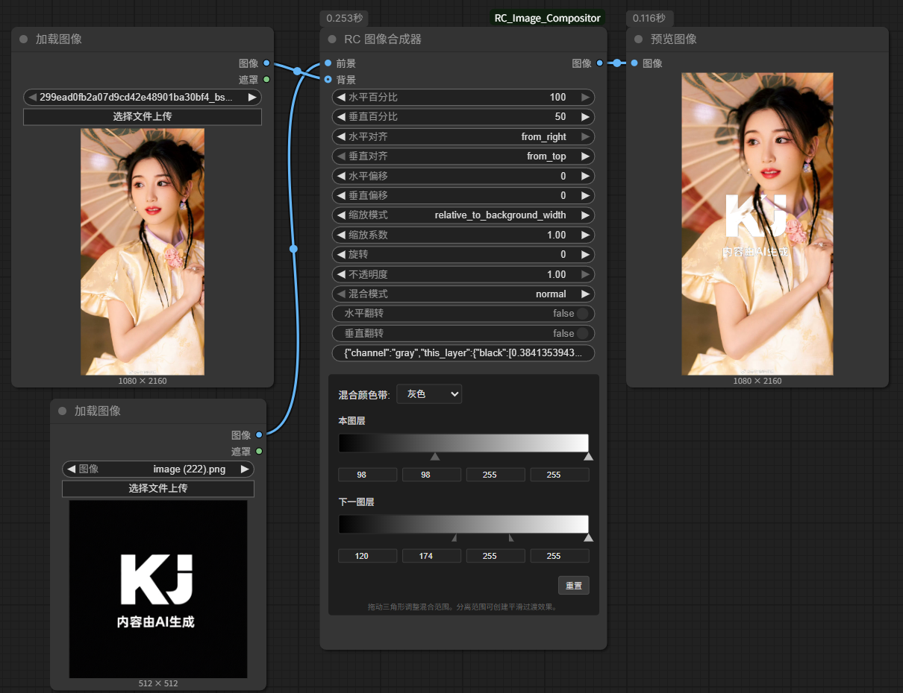
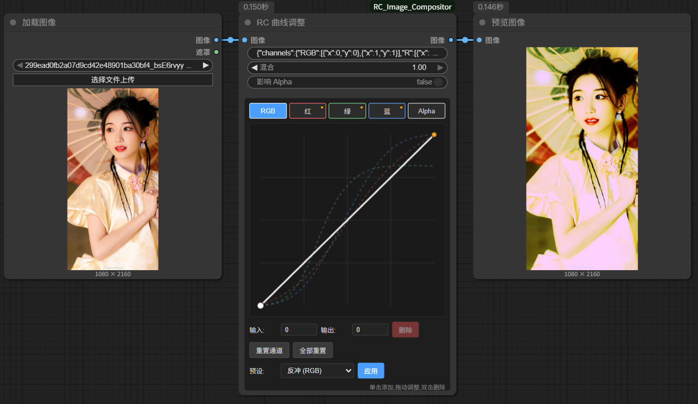
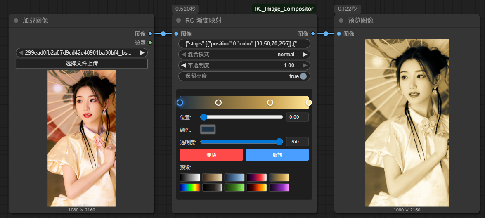
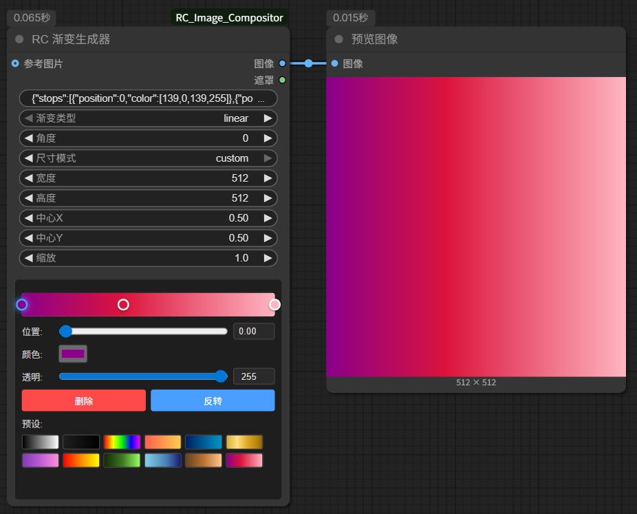
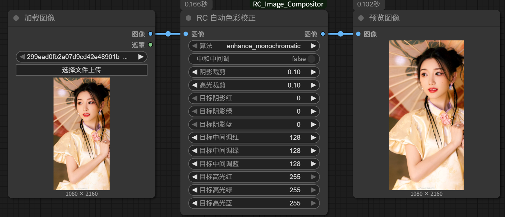
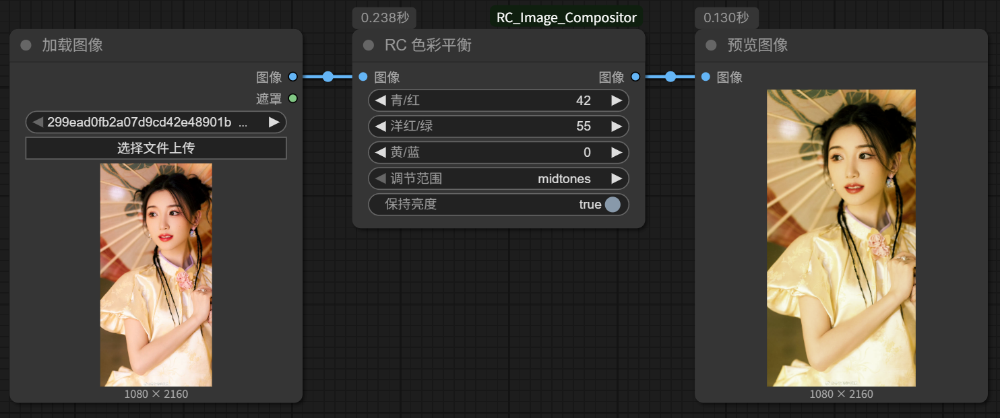
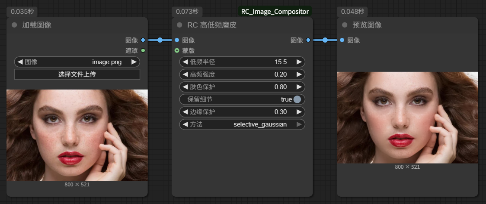
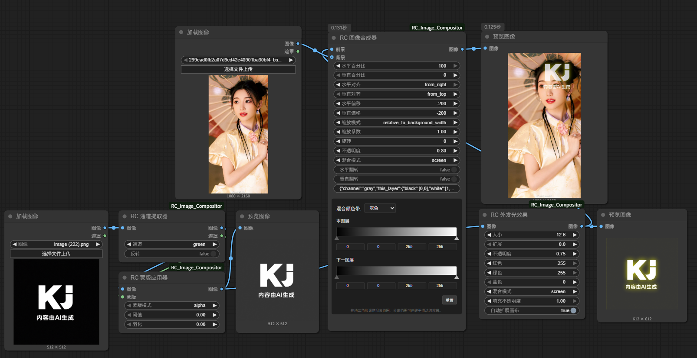

# RC Image Compositor 🎨
## RC 图像合成器

[English Version README](README.md)

---

> ✅ 最近更新：Lightroom/Camera Raw 预设浏览器（交互式预览）、Blend If 滑块视觉提示升级、曲线编辑器适配 ComfyUI 缩放高清重绘、渐变色标支持拖动定位、新增高性能图案平铺与元数据移植流程，现又加入交互式画布节点，实现所见即所得的前景摆放。

目前插件合集共提供 **35 个专业节点**，覆盖图层合成、图层样式、色彩调整、实用工具和生成类功能。

---

## 🖼️ 功能展示

### 专业图层混合

*RC 图像合成器支持全部 24 种专业 Photoshop 风格混合模式，包括 HSL 模式，提供精确的合成控制。*

### 高级曲线调整

*交互式曲线编辑器，采用自然立方样条插值，支持 RGB 和独立通道调整，实现专业色彩分级。*

### 专业渐变映射

*使用渐变映射变换图像 - 完美适用于色彩分级、色调映射和创意色彩效果，支持 16 种混合模式。*

### 智能渐变生成器

*创建自定义渐变，支持多色节点、透明度和各种渐变类型（线性、径向、角度、反射）。*

### 自动色彩校正

*Photoshop 风格的自动色彩校正，提供 4 种智能算法，实现即时图像增强。*

### 专业色彩平衡

*使用 CMY 控制和色调范围选择进行精细色彩平衡调整，实现精确色彩校正。*

### 高低频磨皮

*专业频率分离技术，自动肤色检测和边缘保护，实现自然人像磨皮效果。*

### 完整图层效果工作流

*综合工作流展示外发光效果、图层混合和水印创建 - 全部支持自动画布扩展。*

---

## ✨ 核心特性

### 🎭 **专业图层样式**
- **投影** - 兼容 Photoshop 的投影效果，支持模糊、偏移和颜色控制
- **描边** - 内/外/居中描边定位，支持自定义颜色和自动画布扩展
- **外发光** - 柔和外发光效果，支持扩展、颜色选项和自动画布扩展

### 🎨 **完整混合模式套件**
- **24 专业混合模式** 包括全部 HSL 模式（色相、饱和度、颜色、明度）
- **混合颜色带** - Photoshop 风格的混合颜色带功能，基于通道的蒙版控制，实现高级合成控制
- **增强定位系统** - 使用对齐选项实现精确定位控制
- **详细工具提示** - 每种混合模式都配有视觉描述，支持中英双语
- **可选背景支持** - 当未指定背景时自动创建透明画布，便于纯前景处理

### 🔧 **专业滤镜和调整**
- **高斯模糊** - 专业级模糊效果，支持 PIL/OpenCV 算法选择
- **反锐化蒙版锐化** - 多种锐化算法
- **高低频磨皮** - Photoshop风格频率分离技术，自动肤色检测和边缘保护，专业人像磨皮处理
- **去油光** - 专业油光去除工具，智能检测、多种处理方法、饱和度补偿，实现自然人像修饰效果
- **胶片颗粒** - 真实胶片颗粒效果，基于亮度调制强度（暗部颗粒多、高光颗粒少），颗粒大小控制，中间调/高光保护曲线，颗粒不透明度与模糊调节，多种混合模式（相加/滤色/叠加/柔光/线性减淡），以及单色模式，呈现纯正模拟胶片美学
- **LR/ACR 预设加载器** - Lightroom (.lrtemplate) 和 Camera Raw (.xmp) 预设交互式浏览器，支持实时预览、目录扫描、可调强度，完整色彩分级流程（曝光、对比度、高光/阴影、色调曲线、HSL 调整、分离色调、自然饱和度）
- **色相/饱和度调整** - 像 Photoshop 一样的目标色彩编辑，配备**智能预设**（氰版法、棕褐色、鲜艳度等）
- **透明度控制** - 支持 Alpha 通道的精确透明度调整
- **色阶调整** - Photoshop 风格的交互式色阶控制，支持可拖动手柄进行输入/输出调整、伽马中间调控制、分通道编辑（RGB/红/绿/蓝）和可视化渐变预览
- **曲线调整** - 类似 Photoshop 的多通道曲线，带交互式编辑器、自然立方样条插值、RGB/独立通道支持和预设库
- **亮度/对比度** - 专业级亮度和对比度控制
- **色彩平衡** - 支持色调范围选择的 CMY 色彩平衡
- **通道混合器** - 高级 RGB 通道混合，配备**黑白滤镜预设**（红、橙、黄、绿、蓝、红外滤镜）
- **自动色彩校正** - Photoshop 风格的自动色彩校正，提供 4 种算法（增强单色、逐通道、明暗色彩、亮度对比度）
- **渐变映射** - 专业渐变映射，用于色彩分级、色调映射和创意色彩效果，支持 16 种混合模式和亮度保留
- **阈值调整** - 高对比度黑白转换，支持多种计算方法和反转功能
- **自然饱和度** - 智能饱和度增强，具备可调节肤色保护和高级 HSV 处理
- **添加杂色** - 自定义杂色效果，支持 5 种类型（高斯、高斯模糊、均匀、椒盐、斑点），用于纹理和艺术效果

### 🛠️ **实用工具**
- **画布填充** - 多种填充模式（纯色、边缘、镜像、透明）
- **图像缩放** - 6 种缩放方法，支持高质量重采样
- **图像裁剪** - 支持手动、中心和宽高比裁剪
- **画布调整** - 9 个锚点位置，支持背景色控制
- **无元数据保存/预览** - 在写入 PNG 文件前移除提示词及所有 PNG 元数据，直接得到干净成品或临时预览
- **移植元数据保存/预览** - 从源图像提取工作流元数据并移植到处理后的图像，保留完整 ComfyUI 工作流信息

### 🎞️ **通道操作**
- **通道提取器** - 提取 RGB 通道或亮度作为灰度图或蒙版，常用于抠图工作流
- **蒙版应用器** - 使用蒙版控制图像透明度，羽化平滑自然

### 🌈 **渐变生成与映射**
- **渐变生成器** - 创建支持透明度和多色的渐变图像，高效率查找表驱动，覆盖线性、径向、角度和反射渐变
- **渐变映射** - 专业渐变映射，用于色彩分级、色调映射和创意色彩效果，支持 16 种混合模式和亮度保留
- **精选预设** - 专业渐变预设包括棕褐色、冷蓝色、火焰热度、热成像、黑色电影等，助力快速创意工作流

---

## 🎯 适用场景

- **UI 设计工作流** - Logo 放置、水印、界面元素
- **文字特效** - 带阴影、描边和发光的专业排版效果
- **多图合成** - 带有精确控制的复杂图层合成
- **照片增强** - 色彩校正、锐化和艺术效果
- **专业设计** - 完整的 Photoshop 风格图层工作流

---

## 📦 节点分类

### **RC/Image** - 核心合成 (Core Compositing)
- `RC 图像合成器 (完整版) | RC Image Compositor (Complete)` - 支持 24 种混合模式和增强定位的完整合成器（支持可选背景）
- `RC 加载透明图像 | RC Load Image (Alpha)` - 完整保留 Alpha 通道的 RGBA 图像加载

### **RC/Layer Effects** - Photoshop 图层样式 (Photoshop Layer Styles)
- `RC 投影效果 | RC Drop Shadow` - 支持自动画布扩展的专业投影效果
- `RC 描边效果 | RC Stroke` - 支持自动画布扩展的内/外/居中描边
- `RC 外发光效果 | RC Outer Glow` - 支持自动画布扩展的柔和外发光效果

### **RC/Filters** - 图像处理 (Image Processing)
- `RC 高斯模糊 | RC Gaussian Blur` - 支持算法选择的专业级模糊
- `RC 锐化滤镜 | RC Sharpen` - 包括反锐化蒙版在内的多种锐化方法
- `RC 添加噪点 | RC Add Noise` - 提供高斯、模糊高斯、均匀、椒盐、斑点等 5 种噪点模型，可自定义混合方式
- `RC 胶片颗粒 | RC Film Grain` - 真实胶片颗粒效果，亮度调制强度，颗粒大小控制，中间调/高光保护曲线，颗粒不透明度与模糊，混合模式支持，单色模式
- `RC 高低频磨皮 | RC High/Low Frequency Skin Smoothing` - Photoshop风格频率分离磨皮技术，支持肤色自动检测和边缘保护
- `RC 去油光 | RC Shine/Oil Removal` - 专业油光去除工具，智能亮度和饱和度检测，多种处理算法，饱和度补偿

### **RC/Adjustments** - 色彩和色调 (Color & Tone)
- `RC 色相/饱和度 | RC Hue/Saturation` - 带着色模式的目标色彩调整
- `RC 透明度调整 | RC Opacity Adjust` - 支持 Alpha 通道的精确透明度控制
- `RC 色阶调整 | RC Levels` - 支持伽马校正的专业色阶调整
- `RC 曲线调整 | RC Curves` - 带交互式编辑器的多通道曲线调整，支持自然立方样条插值、RGB/独立通道和预设库
- `RC 亮度/对比度 | RC Brightness/Contrast` - 双算法亮度和对比度控制
- `RC 色彩平衡 | RC Color Balance` - 支持色调范围定位的 CMY 色彩平衡
- `RC 通道混合器 | RC Channel Mixer` - 支持单色模式的高级 RGB 通道混合
- `RC 渐变映射 | RC Gradient Map` - 通过 16 种混合模式进行 LUT 级别的渐变重映射，兼顾亮度保护
- `RC 阈值 | RC Threshold` - 多算法高对比度转换，可选反转模式
- `RC 活力 | RC Vibrance` - 智能饱和度提升，提供肤色保护调节
- `RC 自动色彩校正 | RC Auto Color Correction` - 四种自动校正策略（单通道、分通道、阴影/高光、动态对比）
- `RC LR/ACR 预设 | RC LR/ACR Preset` - Lightroom/Camera Raw 预设交互式浏览器，实时预览、目录扫描、可调强度

### **RC/Utilities** - 画布和变换 (Canvas & Transform)
- `RC 画布填充 | RC Canvas Padding` - 支持多种填充模式的画布扩展
- `RC 图像缩放 | RC Image Scale` - 支持 6 种不同方法的专业缩放
- `RC 图像裁剪 | RC Image Crop` - 支持手动、中心和比例模式的灵活裁剪
- `RC 画布调整 | RC Canvas Resize` - 支持 9 个锚点的画布调整
- `RC 交互画布 | RC Interactive Canvas` - 类 Photoshop 前景交互画布：支持移动/缩放/旋转、边框手柄、平滑橡皮擦笔刷、重置控制与 Pass Forward 输出协同
- `RC 无元数据保存 | RC Save Image (No Metadata)` - 输出时剔除提示词与 PNG 元数据
- `RC 无元数据预览 | RC Preview Image (No Metadata)` - 快速预览并传递图像，同时移除元数据
- `RC 移植元数据保存 | RC Save Image (Transfer Metadata)` - 从源图像提取工作流元数据并移植到处理后的图像，保存时包含完整 ComfyUI 工作流信息
- `RC 移植元数据预览 | RC Preview Image (Transfer Metadata)` - 从源图像提取工作流元数据并移植到处理后的图像，双图预览显示

### **RC/Channel** - 通道和蒙版操作 (Channel & Mask Operations)
- `RC 通道提取器 | RC Channel Extractor` - 提取 RGB 通道或亮度作为灰度图或蒙版，常用于抠图工作流
- `RC 蒙版应用器 | RC Mask Apply` - 使用蒙版控制图像透明度，羽化边缘更平滑

### **RC/Generate** - 生成操作 (Generate Operations)
- `RC 渐变生成器 | RC Gradient Generator` - 创建支持透明度和多色的渐变图像，查找表加速覆盖线性、径向、角度和反射渐变
- `RC 图案平铺 | RC Pattern Tiling` - 高性能图案平铺节点，支持平铺前裁剪、缩放、旋转、间距、偏移和透明度控制

---

## 🚀 安装方法

### 方法 1：ComfyUI 管理器（推荐）
1. 打开 **ComfyUI Manager**
2. 进入 **安装自定义节点**
3. 搜索 **"RC Image Compositor"**
4. 点击 **安装**

### 方法 2：手动安装
```bash
cd ComfyUI/custom_nodes
git clone https://github.com/kj863257/ComfyUI_RC_Image_Compositor
cd ComfyUI_RC_Image_Compositor
pip install -r requirements.txt
```
然后重启 ComfyUI

---

## 🎨 精确定位系统

### **边缘对齐**
- **右边缘，紧贴**：`x_percent=100`, `x_align=from_right`, `x_offset=0`
- **左边缘，紧贴**：`x_percent=0`, `x_align=from_left`, `x_offset=0`
- **底边缘，紧贴**：`y_percent=100`, `y_align=from_bottom`, `y_offset=0`

### **使用示例**
1. **右上角，10px 边距**：
   - `x_percent=100`, `x_align=from_right`, `x_offset=10`
   - `y_percent=0`, `y_align=from_top`, `y_offset=10`

2. **左下角，20px 边距**：
   - `x_percent=0`, `x_align=from_left`, `x_offset=20`
   - `y_percent=100`, `y_align=from_bottom`, `y_offset=20`

---

## 🔧 高级功能

### **完整混合模式兼容性**
所有 24 种混合模式在数学上都与 Photoshop 的实现完全相同，并配有详细工具提示：

**🌟 基本模式：**
- 正常 - 直接覆盖

**🌑 变暗模式：**
- 变暗, 正片叠底, 颜色加深, 线性加深

**🌕 变亮模式：**
- 变亮, 滤色, 颜色减淡, 线性减淡

**⚡ 对比模式：**
- 叠加, 柔光, 强光, 亮光, 线性光, 点光, 实色混合

**🔄 比较模式：**
- 差值, 排除, 减去, 划分

**🎨 HSL 模式：**
- 色相, 饱和度, 颜色, 明度

### **自动画布扩展**
图层效果会在效果超出原始边界时自动扩展画布：
- 投影：为投影距离和模糊扩展画布
- 描边：为外部和居中描边扩展画布
- 外发光：为发光大小和扩展扩展画布

### **专业色彩编辑**
- 在色相/饱和度中针对特定色彩范围（红、蓝等）进行调整
- 在色彩平衡调整中保留明度
- 通道特定的色阶调整（RGB、红、绿、蓝）
- 带自定义通道混合的单色转换
- **高级曲线调整** - 带交互式编辑器的 Photoshop 风格多通道曲线，支持自然立方样条插值、RGB/独立通道和预设

### **高级蒙版和通道操作**
- **通道提取** - 从图像中提取特定通道（红、绿、蓝、透明或亮度）用于抠图
- **蒙版应用** - 使用蒙版控制图像透明度，实现精确的抠图效果
- **透明背景支持** - 当不提供背景时自动创建透明画布，便于处理独立前景元素

---

## 🌟 为什么选择 RC 图像合成器？

- **🎯 Photoshop 精度**：数学上完全相同的混合模式和效果
- **🚫 对齐问题**：增强的定位系统解决对齐问题
- **🌐 双语支持**：完整的中英双语界面和文档
- **🔧 专业级别**：专为生产工作流构建，支持自动画布扩展
- **📱 用户友好**：详细的工具提示解释每个参数和混合模式
- **🚀 高性能**：基于 NumPy / OpenCV / PIL 的向量化实现，处理大图依然流畅
- **🛠️ 可扩展**：简洁的模块化架构，便于自定义

---

## 📄 许可证

本项目采用 MIT 许可证。

---

## Star History

[](https://www.star-history.com/#kj863257/ComfyUI_RC_Image_Compositor&Date)

---

*为 ComfyUI 社区精心打造 ❤️*

> **"在 ComfyUI 中实现完整的 Photoshop 功能 - 专业节点，24 种混合模式"**
